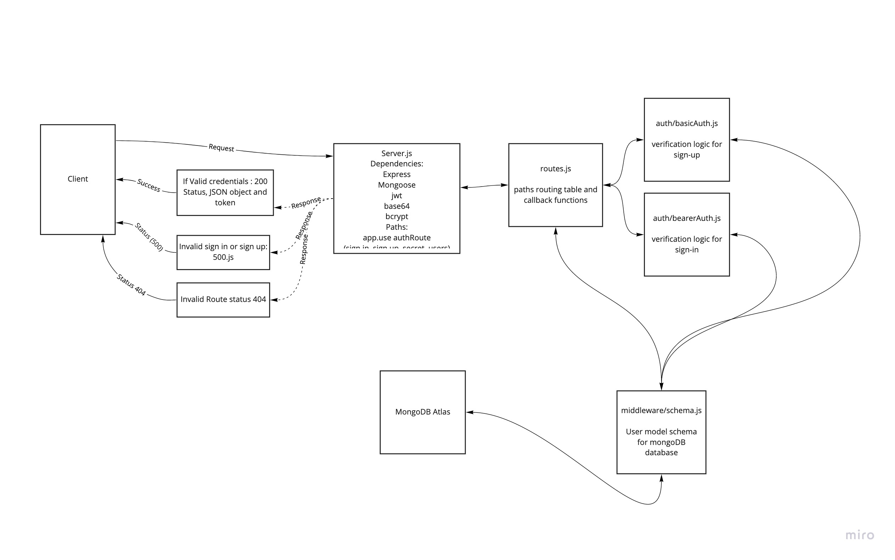

# bearer-auth

## Github PR
https://github.com/IbrahimAbuawad/bearer-auth/pull/1
## Github Actions

https://github.com/IbrahimAbuawad/bearer-auth/actions

## Heroku URLs

https://ibrahimawad-bearer-auth.herokuapp.com

## UML

## Class notes
* Learn how to encode and encrypt user information
* Learn how to utilize third party mock api testing such as httpie
* Learn how to send request headers
* Continue to learn how to use MongoDB
